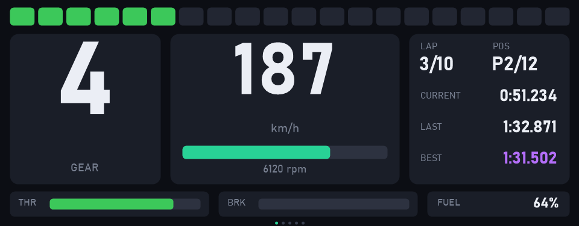
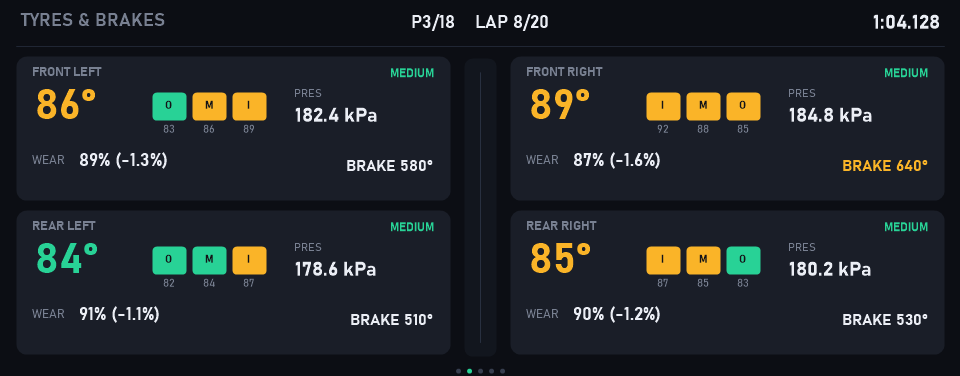
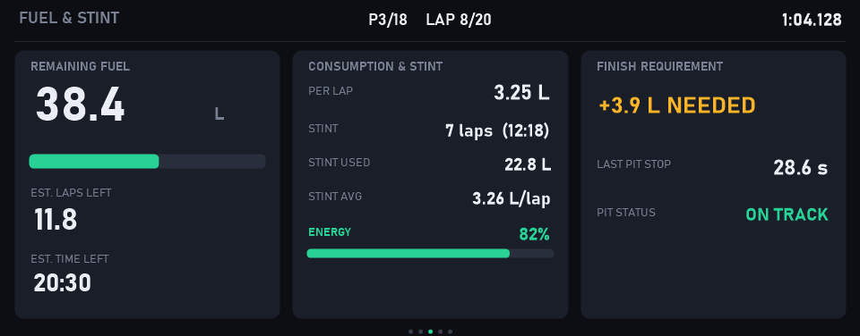
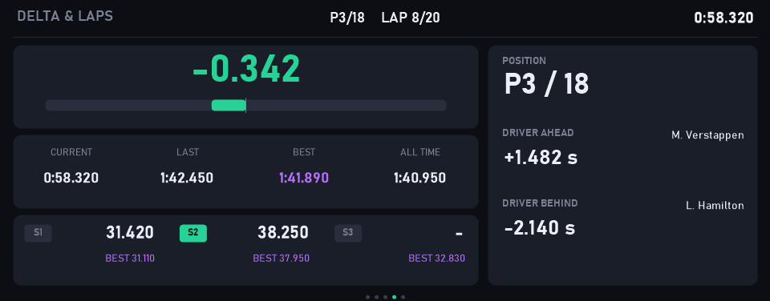
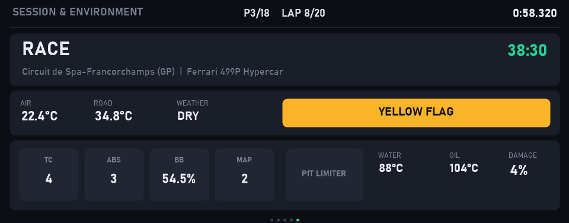
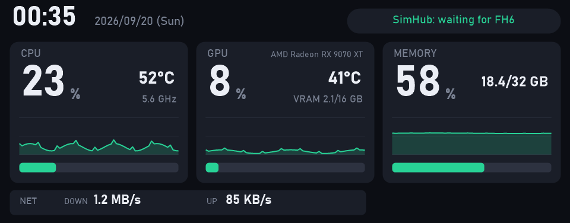
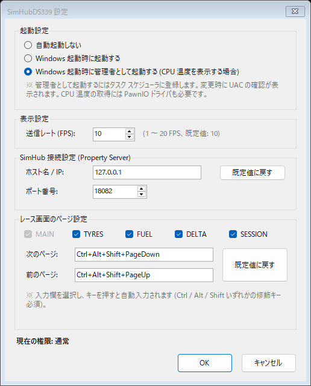

# ds339-simhub

JONSBO 製 3.39 インチサブディスプレイ **DS339** に、SimHub のテレメトリ (速度・ギア・RPM・ラップタイムなど) を **USB で直接** 表示するためのツール群です。
ゲームを起動していないあいだは PC ステータス (CPU/GPU/メモリの使用率・温度など) を表示します。

DS339 は MacroSilicon MS912C (USB VID `345F` / PID `9132`) を搭載した独自プロトコルのデバイスで、InfoPanel は非対応、AIDA64 は有償です。そこで純正アプリ JONSBO-AIO の USB 通信をキャプチャしてプロトコルを解析し、自前で描画・転送できるようにしました。

> [!WARNING]
> 非公式ツールです。**使用は自己責任** でお願いします。詳しくは [免責事項](#免責事項) を参照してください。

### レース画面 (全 5 ページ)

グローバルホットキー (既定: `Ctrl+Alt+Shift+PageDown` / `PageUp`) やタスクトレイメニューでページを切り替えられます。

| 1. MAIN (メイン) | 2. TYRES (タイヤ・ブレーキ) |
|---|---|
|  |  |
| **3. FUEL (燃料・スティント)** | **4. DELTA (デルタ・ラップ)** |
|  |  |
| **5. SESSION (セッション・環境)** | **待機時: PC ステータス画面** |
|  |  |

```
SimHub → [Property Server plugin, TCP:18082] → SimHubDS339 (GDI+ で 960x376 描画) → libusb → DS339
```

## 構成

| ディレクトリ | 内容 | 状態 |
|---|---|---|
| [`SimHubDS339/`](SimHubDS339/) | **本命**。SimHub のデータをダッシュボードとして描画し、DS339 に送り続ける常駐アプリ | 動作確認済み |
| [`DS339Direct/`](DS339Direct/) | DS339 の USB プロトコル実装 (`Ms9132Device.cs`) と、画像を送るテスト用 CLI | 動作確認済み |
| [`docs/`](docs/) | [プロトコル解析の記録](docs/ds339-reverse-engineering.md) | — |

## 必要なもの

- Windows 10 以降、.NET 8 SDK
- [SimHub](https://www.simhubdash.com/) と [SimHub Property Server](https://github.com/pre-martin/SimHubPropertyServer) プラグイン (`PropertyServer.dll`、ポート 18082)
- [Zadig](https://zadig.akeo.ie/) — DS339 のドライバ差し替え用
- (任意) [PawnIO](https://pawnio.eu/) — CPU 温度を表示する場合のみ。管理者としての起動も必要

## セットアップ

1. **SimHub Property Server を導入**
   `PropertyServer.dll` を SimHub のインストールフォルダに置き、SimHub 起動時のダイアログで「Property Server」を有効にします。

2. **DS339 のドライバを WinUSB に差し替え**
   Zadig を起動し、`Options` → `List All Devices` を有効にして `msusb video (Interface 3)` (USB ID `345F 9132 03`) を選び、`WinUSB` に置き換えます。
   ※ インターフェース 0 (HID) は触りません。

3. **JONSBO-AIO / AIDA64 の DS339 出力を止める**
   同じデバイスを取り合うため、同時には使えません。

4. **ビルド**

   ```bash
   cd SimHubDS339
   dotnet build -c Release
   ```

## 使い方

### 起動

次の 2 つを起動します。順番はどちらが先でも構いません。

1. SimHub
2. `SimHubDS339\bin\Release\net8.0-windows\SimHubDS339.exe` (ダブルクリック)

起動するとタスクトレイにアイコンが出ます (コンソールウィンドウは出ません)。

- SimHub 未接続・ゲーム未起動の間は **PC ステータス画面**、ゲームで走り始めると **レース画面** に自動で切り替わります
- SimHub やゲームが後から起動しても、自動で接続されます
- SimHub だけを起動しても表示されません。`SimHubDS339.exe` も必ず起動してください
- CPU 温度を表示するには PawnIO + 管理者起動が必要です (詳細は [SimHubDS339/README.md](SimHubDS339/README.md#cpu-温度について) を参照)
- オプション (`--fps`、`--demo`、`--preview`、`--probe`、`--console` など) は [SimHubDS339/README.md](SimHubDS339/README.md) を参照してください

### レース画面のページ切り替え

レース中 (`SimHubConnected && GameRunning`) は、グローバルホットキーまたはトレイメニューで画面を切り替えられます。

- **次のページ**: `Ctrl + Alt + Shift + PageDown` (既定)
- **前のページ**: `Ctrl + Alt + Shift + PageUp` (既定)
- **タスクトレイメニュー**: アイコン右クリック →「次のページ」「前のページ」
- ページ切替直後の 1.5 秒間は中央上部にページ名がオーバーレイ表示され、画面最下部に有効ページ数と現在位置を示すドットインジケータが表示されます。
- ハンドルコントローラー等のボタンで切り替えたい場合は、SimHub の「Controls and events」機能でステアリングのボタンにキーボードエミュレーション (既定の `Ctrl+Alt+Shift+PageDown` 等) を割り当ててください。

### 設定

タスクトレイのアイコンをダブルクリックするか、右クリック →「設定...」を開くと、次の設定を変更できます。



- Windows 起動時の自動起動 (しない / 通常権限で起動 / 管理者として起動)
- 送信レート (FPS)
- SimHub Property Server の接続先 (ホスト / ポート)
- レース画面のページ設定 (各ページの有効/無効化、切替ホットキーの変更)

設定ファイルとログファイルの場所:
- 設定: `%APPDATA%\SimHubDS339\settings.json`
- ログ: `%LOCALAPPDATA%\SimHubDS339\SimHubDS339.log` (トレイメニューの「ログを開く」からも確認可能)

### 終了

- タスクトレイアイコンを右クリック →「終了」をクリックします
- 終了後も DS339 には **最後の画面が静止したまま残ります**。消したい場合は DS339 の USB を抜き差ししてください

### 使用上の注意

- JONSBO-AIO と同時には使えません (DS339 を取り合います)
- 二重起動は自動で防止されます (すでに起動している場合はメッセージが表示されて終了します)
- 動作確認済みのゲーム: Le Mans Ultimate (LMU)

## 更新履歴

- **2026-09-20**
  - レース画面に 4 つの追加ページ (**TYRES**: タイヤ/ブレーキ、**FUEL**: 燃料/スティント、**DELTA**: デルタ/ラップ/ギャップ、**SESSION**: セッション/環境/車両設定) を追加し、全 5 ページ構成に拡張しました
  - グローバルホットキー (`Ctrl+Alt+Shift+PageDown` / `PageUp`) およびトレイメニューによるレース画面のページ切替に対応しました
  - 設定ウィンドウに「レース画面のページ設定」を追加し、各ページの ON/OFF 切り替えとホットキーのカスタマイズに対応しました
  - ページ切替時の中央上部オーバーレイ表示 (1.5秒) と、最下部のページインジケータを追加しました
  - ピットアウトを検知して今スティントの周回数・経過時間・消費燃料・平均燃費を追跡する `StintTracker` を実装しました
  - SimHub Property Server から候補プロパティ一覧を取得する `--probe` オプションを追加しました
  - タスクトレイ常駐アプリになりました。起動してもコンソールウィンドウは開かず、トレイアイコンから設定・ログ・終了を操作します (従来の動作は `--console`)
  - 設定ウィンドウを追加しました。Windows 起動時の自動起動 (しない / 通常権限 / 管理者)、FPS、SimHub の接続先を変更できます
  - トレイメニューに「管理者として再起動」を追加しました (CPU 温度の表示用)
  - 二重起動を自動で防ぐようにしました
  - ゲーム未起動時の待機画面を、時計だけの画面から **PC ステータス画面** (CPU/GPU/メモリの使用率・温度・クロック、VRAM、直近 60 秒のグラフ、ネットワーク速度) に変更しました
  - PC の値の取得に LibreHardwareMonitorLib を使います。CPU 温度には PawnIO ドライバと管理者権限が必要です。CPU クロックはどちらもなくても表示されます
  - `--sensors` オプションを追加しました (検出したセンサーの一覧表示)

## DS339 プロトコルの要点

詳細と解析の経緯は [docs/ds339-reverse-engineering.md](docs/ds339-reverse-engineering.md) にまとめています。

| 項目 | 値 |
|---|---|
| コマンド | HID Feature Report 8 バイト (SET_REPORT / GET_REPORT、インターフェース 0) |
| 画像 | Bulk OUT ep 4 (インターフェース 3)、65536 バイトずつ + ゼロ長パケット |
| フレーム | 376x960、見た目は横置き 960x376 (時計回りに 90° 回転して送る) |
| 画素 | 非圧縮 3 バイト、B,G,R 順。**0xFF は予約値なので 254 に丸める** |
| ヘッダ / トレイラ | `FF x(16) y(16) w(12)h(12)` / `FF C0 00 00 00 00 00 00` |
| 初期化 | 転送モード 3 (MANUAL_BLOCK)、入力 color `0x11`、出力 VIC `0xAB` / color `0x00`、GPIO 初期化 |
| 表示開始 | 2 フレーム送信後に xdata `0xF005 = 0x50` → 映像有効 |
| ハートビート | xdata `0x0032` を 500ms 周期で読み出し |

## 元に戻す

JONSBO-AIO に戻す場合は、Zadig でインターフェース 3 のドライバを `libusb-win32` に戻してください。

## 免責事項

- 本ソフトウェアは、純正アプリの通信を解析して作成した **非公式** のツールです。JONSBO、MacroSilicon、SimHub とは一切関係がなく、各社への問い合わせはご遠慮ください。
- **使用は自己責任** でお願いします。本ソフトウェアの使用、および Zadig によるドライバの差し替えによって生じたいかなる損害 (DS339・PC の故障や不具合、データの消失、製品保証が受けられなくなることなどを含む) についても、作者は一切の責任を負いません。
- 動作は保証しません。動作確認は手元の DS339 1 台 (chip_id `3` = MS912C、port_type `6`) と Le Mans Ultimate のみで、個体差やファームウェアの違い、SimHub・ゲームのアップデートにより動かなくなる可能性があります。
- 本ソフトウェアは GPL-2.0 の定めにより **無保証 (NO WARRANTY)** で提供されます ([LICENSE](LICENSE) の第 11・12 条)。

## ライセンス

このリポジトリは **GNU General Public License v2.0** で公開します ([LICENSE](LICENSE))。

`DS339Direct/Ms9132Device.cs` は MacroSilicon Technology Co., Ltd. の GPL-2.0 ドライバソースを参照・移植しており、これを組み込む `SimHubDS339` も含めて GPL-2.0 としています。

同梱・依存しているサードパーティのソフトウェアとそのライセンスは [THIRD-PARTY-NOTICES.md](THIRD-PARTY-NOTICES.md) を参照してください。
