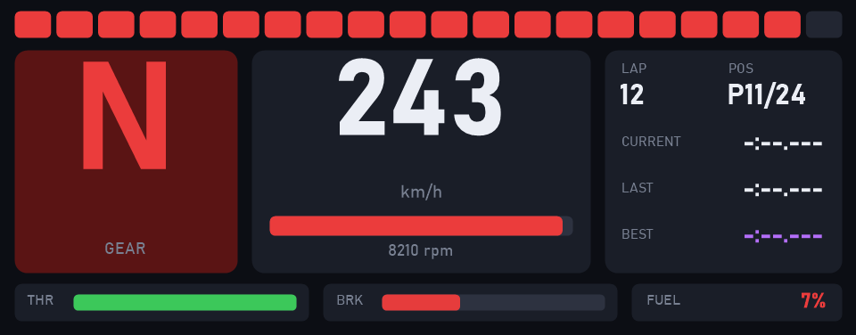

# JONSBO DS339 に SimHub のダッシュボードを直接表示するまで ― USB プロトコル解析の記録

JONSBO のサブディスプレイ **DS339** に、レースシム用ツール **SimHub** のテレメトリ (ギア・速度・RPM・ラップタイムなど) を表示したい。
ところが既存のツールでは思うように表示できなかった。そこで USB 通信を解析し、公式アプリも AIDA64 も使わずに PC から直接描画できる状態にした。
この記事は、その調査と実装の記録です。

> 注意: この記事はドライバの置き換えなど、自己責任の作業を含みます。元に戻す手順は最後に書いています。

---

## 1. 目的と前提

- **やりたいこと**: SimHub の値を DS339 に、好きなレイアウトでリアルタイム表示する
- **環境**: Windows 11 / .NET 8 / SimHub + [SimHub Property Server](https://github.com/pre-martin/SimHubPropertyServer) プラグイン
- **DS339 の正体**: USB VID `345F` / PID `9132`。MacroSilicon の USB ディスプレイ用チップ **MS9132 系** (チップ ID の読み出しでは MS912C 相当)

## 2. 最初に試したこと (回り道)

### 2-1. InfoPanel 経由

最初はオープンソースのパネル表示ツール InfoPanel 用のプラグインを作り、SimHub の値を流し込もうとした (このプラグインは不要になったためリポジトリには含めていない)。
しかし InfoPanel が対応しているのは BeadaPanel や Turing 系のパネルで、**MacroSilicon のチップを載せた DS339 には描画できない**ことがわかった。

### 2-2. AIDA64 経由

AIDA64 は DS339 に公式対応している。そこで、SimHub の値を AIDA64 の External Applications (レジストリ経由の値取り込み) に書き込むブリッジを作った (`SimHubAida64Bridge`)。
これは動作する。ただし AIDA64 が必要で、レイアウトの自由度や更新レートも AIDA64 に依存する。

**そこで、DS339 を USB から直接制御する方針に切り替えた。**

## 3. 手がかり: MacroSilicon の公式 Linux ドライバ

MacroSilicon は USB ディスプレイチップ用の Linux ドライバを GPL で公開している (`ms91xx-linux-drm`)。
`usb_hal` 以下のソースを読むと、通信の基本構造がわかった。

- **コマンド**: HID Feature Report (8 バイト固定) を、コントロール転送の SET_REPORT / GET_REPORT で送受信する
- **画像データ**: Vendor Specific インターフェースの **Bulk OUT (endpoint 4)** で送る

主なコマンド (レポートの 1 バイト目):

| op | 意味 |
|---|---|
| `B5` | xdata レジスタ読み出し (`B5 addrH addrL` を SET → GET で値を受け取る) |
| `B6` | xdata レジスタ 1 バイト書き込み |
| `C5` / `C6` | SFR 読み出し / 書き込み |
| `F5` | SPI フラッシュ 8 バイト読み出し |
| `A6 sub ...` | ビデオ系コマンド (sub: 01=入力情報, 02=出力情報, 03=転送モード, 04=転送有効, 05=映像有効, 07=電源) |

これをもとに C# (LibUsbDotNet + libusb-1.0) でクライアント `Ms9132Device` を実装した。

### ドライバの準備

DS339 は複数のインターフェースを持つ複合デバイスになっている。

- インターフェース 0: HID (Windows 標準ドライバのまま)
- インターフェース 3: Vendor Specific (Bulk 転送用。元は `libusb-win32`)

libusb-1.0 から Bulk 転送するため、**Zadig でインターフェース 3 だけを WinUSB に置き換えた**。
HID の Feature Report はデバイスハンドルからのコントロール転送で送れるので、インターフェース 0 はそのままで問題ない。

## 4. 公式ドライバの手順だけでは映らない → 実機の通信をキャプチャ

Linux ドライバは HDMI/VGA 出力のドングルを想定した汎用ロジックで、DS339 のような「パネル直結」の構成とは手順が違った。
そこで、**正常に表示できている JONSBO 公式アプリの USB 通信を Wireshark + USBPcap でキャプチャ**した (約 100MB、約 40 秒分)。

### 4-1. キャプチャから読み取れた初期化シーケンス

pcap を Python で直接パースし (USBPcap のリンクタイプ 249 のヘッダを自前で解釈)、DS339 宛ての SET_REPORT / GET_REPORT を時系列に並べた。

```
B5 FF00 / B5 F000        チップ ID 確認 (F000 → B7 16 0A)
B5 0031 / B5 0030        ポート種別 / SDRAM 種別
F5 ...                   フラッシュ読み出し
A6 07 01 02              電源 ON
A6 05 00                 映像 無効
B5 F005 → B6 F005 40     画面制御レジスタ
C5 B0 → C6 B0 DF         GPIO 設定
C5 A0 → C6 A0 E4 → C6 A0 F0
B5 F016 → B6 F016 08
A6 03 03                 転送モード = 3 (MANUAL_BLOCK)
A6 01 0178 03C0 11 00    入力: 376 x 960, color 0x11
A6 02 AB 00 0178 03C0    出力: VIC 0xAB, color 0x00, 376 x 960
A6 04 01                 転送 有効
  (Bulk 転送 × 2 フレーム)
B5 F005 → B6 F005 50     画面 表示
A6 05 01                 映像 有効
```

ここからわかったこと:

- 解像度は **376 x 960 (縦長)**。見た目の 960x376 ではない
- 転送モードは 3 (MANUAL_BLOCK)。`trigger_frame` コマンドは一度も使われない
- 画面の表示は、公式ドライバのような read-modify-write ではなく、`0xF005` への直接書き込み (`0x40` → `0x50`) で行う

この手順を再現したところ、**起動ロゴ → 消灯 → 真っ暗** まで進んだ。
制御コマンドは効いているが、映像は出ない。さらに 2 フレーム目以降の Bulk 転送がタイムアウトする。ここでいったん詰まった。

## 5. 真っ暗の原因を切り分ける

### 5-1. フレームには 8 バイトのヘッダとトレイラが必要だった

Bulk 転送の合計サイズを数え直すと、次のようになっていた。

```
65536 × 16 + 34320 = 1,082,896 バイト
376 × 960 × 3      = 1,082,880 バイト
```

**16 バイト多い。** 先頭と末尾を見ると、次のバイト列があった。

```
先頭: FF 00 00 00 00 17 83 C0
末尾: FF C0 00 00 00 00 00 00
```

- ヘッダ: `FF` + x (16bit) + y (16bit) + **幅 12bit / 高さ 12bit** (`0x178`=376, `0x3C0`=960 を 3 バイトに詰めたもの)
- トレイラ: `FF C0` + 0 埋め (end of buffer)

最初の実装は画素データだけを送っていた。ヘッダもトレイラもなければ、チップが「どこに描くデータか」を判断できないのは当然だった。

> 落とし穴: 以前キャプチャから抽出したフレームデータはサイズが合わなかった。USBPcap の snaplen が 65535 だったため、**65536 バイトの転送ごとに末尾の 28 バイトが欠けていた**のが原因。サイズで検算する場合は、pcap のレコードの incl_len と、USBPcap ヘッダのデータ長を突き合わせる必要がある。

### 5-2. 画素フォーマットの確認

欠けた 28 バイトを 0 で埋め、ヘッダの後ろを 376x960 の RGB888 として画像化すると、公式アプリのテーマ画像 (ロボットのイラストと CPU/GPU 表示) がきれいに復元できた。
つまり **非圧縮の 3 バイト/画素** で送られている。

ヘッダとトレイラを付けて送ると、**公式画像のリプレイが実機に正しく表示された**。

## 6. 「点滅」と「転送が遅い」問題 ― 0xFF は予約値だった

自作のテスト画像 (赤・緑・青の帯に白文字) を送ると、今度は別の症状が出た。

- 画像とメーカーロゴが交互に点滅する
- 1 フレームの転送に **12 秒** かかる (公式画像は 35ms)

**画像の中身によって転送速度が変わる**ので、データのバイト値を疑った。キャプチャした全フレームのバイト分布を調べると、次のようになっていた。

```
0xFE: 約 16,600 回 / フレーム
0xFF: 1 回 / フレーム (トレイラの分だけ)
```

公式アプリの画素データには **0xFF が一度も出てこない**。255 はすべて 254 に丸められていた。
ヘッダとトレイラが `FF` で始まることからも、**0xFF はマーカーとして予約されている**と考えられる。画素に 0xFF が混ざると、チップ側のパーサが誤解釈して極端に遅くなる。

`0xFF → 0xFE` に置き換えるだけで、転送は 35ms に戻り、点滅も止まった。
前回の「2 フレーム目以降がタイムアウトする」問題も、原因はこれだった (テストパターンに 255 を使っていた)。

## 7. 色の順番と画面の向き

色テスト画像を表示すると、「RED」と書いた帯が青、「BLUE」の帯が赤系で表示された。
**パネル上のバイト順は B,G,R** だった。

続いて、帯が「左から」並んで見えるとの報告があった。DS339 は **横置き (見た目 960x376)** で、チップ上のフレームの 0 行目が画面の左端に来る。
「TOP-LEFT」「BOTTOM-RIGHT」と書いた横長画像を **時計回りに 90 度回転** して送ると、正しい向きで読めた。


最終的な変換はこうなった。

```
見た目 960x376 の RGB 画像
  → 時計回りに 90° 回転して 376x960 に
  → 各画素を B,G,R 順に並べ替え、0xFF は 0xFE に
  → [FF 00 00 00 00 17 83 C0] + 画素 + [FF C0 00 00 00 00 00 00]
  → 65536 バイトずつ Bulk OUT (ep 4)、最後にゼロ長パケット
```

## 8. ハートビート

公式アプリは、フレーム送信とは独立に **xdata `0x0032` を 500ms 周期で読み続けている**。
直接の必要性は確認しきれていないが、公式アプリの挙動に合わせて同じ周期で読むようにした。
フレームは公式アプリだと約 2fps で送っていたが、100ms 周期 (10fps) でも問題なく受け付けた。

## 9. SimHub ダッシュボードアプリ `SimHubDS339`

プロトコルが固まったので、常駐アプリにまとめた。

```
SimHub → Property Server (TCP:18082) → SimHubDS339
        → GDI+ で 960x376 のダッシュボードを描画
        → 回転・BGR 変換・0xFF 回避
        → libusb で DS339 に 10fps 送信
```





- **待機画面**: 時計・日付・SimHub の接続状態
- **レース画面**: シフトライト、ギア、速度、RPM バー、ラップ/順位、現在・前回・ベストのラップタイム、スロットル/ブレーキ、燃料
- 送信失敗・USB エラー・デバイス使用中のときは、3 秒ごとに自動で再接続
- `--demo` で擬似データのレース画面、`--preview` でデバイスなしの PNG 出力

### 検証結果

| 項目 | 結果 |
|---|---|
| 10fps で約 9 分連続送信 | 毎分 600〜601 フレーム、エラー 0 |
| 1 フレームの転送時間 | 約 35ms |
| CPU / メモリ | 1 コアの約 2.7% / 約 49MB |
| デバイス使用中に起動 | Access denied を 3 秒ごとに再試行し、解放後に自動接続 |
| 常駐中に別プロセスが同じデバイスを開く | 別プロセス側が弾かれ、常駐側に影響なし |

## 10. わかった仕様のまとめ

| 項目 | 値 |
|---|---|
| USB ID | VID `345F` / PID `9132` (MacroSilicon) |
| コマンド | HID Feature Report 8 バイト (SET_REPORT / GET_REPORT) |
| 画像 | Bulk OUT ep 4、65536 バイトずつ + ゼロ長パケット |
| フレーム解像度 | 376 x 960 (見た目は横置きの 960x376、時計回り 90° 回転) |
| 画素 | 非圧縮 3 バイト、**B,G,R** 順 |
| ヘッダ | `FF` x(16) y(16) w(12)/h(12) |
| トレイラ | `FF C0 00 00 00 00 00 00` |
| 予約値 | **画素に 0xFF を入れない** (254 に丸める) |
| 転送モード | 3 (MANUAL_BLOCK)、入力 color `0x11`、出力 VIC `0xAB` / color `0x00` |
| 表示開始 | 2 フレーム送信後に `0xF005 = 0x50` → 映像有効 |
| ハートビート | xdata `0x0032` を 500ms 周期で読み出し |

## 11. 振り返り ― 効いた調査手法

1. **公式 OSS ドライバでコマンド体系を把握** → 通信の土台はすぐにできた
2. **正常動作時の通信をキャプチャして、そのまま再現** → 汎用ドライバとの違い (解像度・モード・レジスタ) が見つかった
3. **数を合わせる**: 転送サイズの 16 バイト差からヘッダとトレイラが見つかった
4. **キャプチャしたデータを画像化**して、フォーマットの仮説を目で確認した
5. **症状が中身に依存するなら、バイト分布を統計で比べる** → 0xFF の予約が見つかった
6. **非対称なテスト画像** (色名の文字、隅の三角、TOP-LEFT 表記) で、色順と向きを 1 回ずつで確定させた

また、キャプチャの snaplen による切り捨てのように、「解析に使っているデータ自体が壊れていないか」を疑うことも大事だった。

## 元に戻す方法

JONSBO の公式アプリ (JONSBO-AIO) に戻す場合は、Zadig で DS339 のインターフェース 3 のドライバを `libusb-win32` に戻してください。
